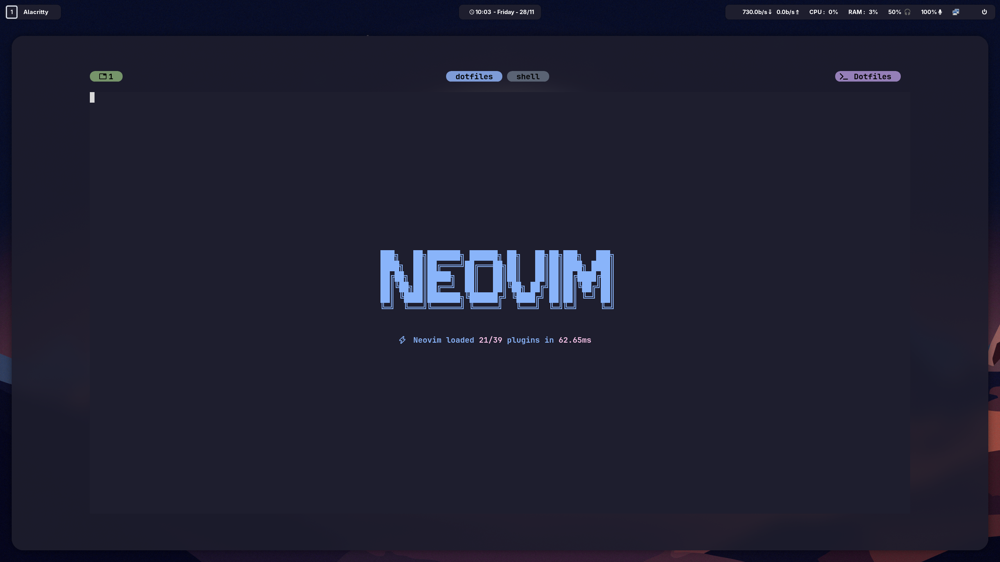
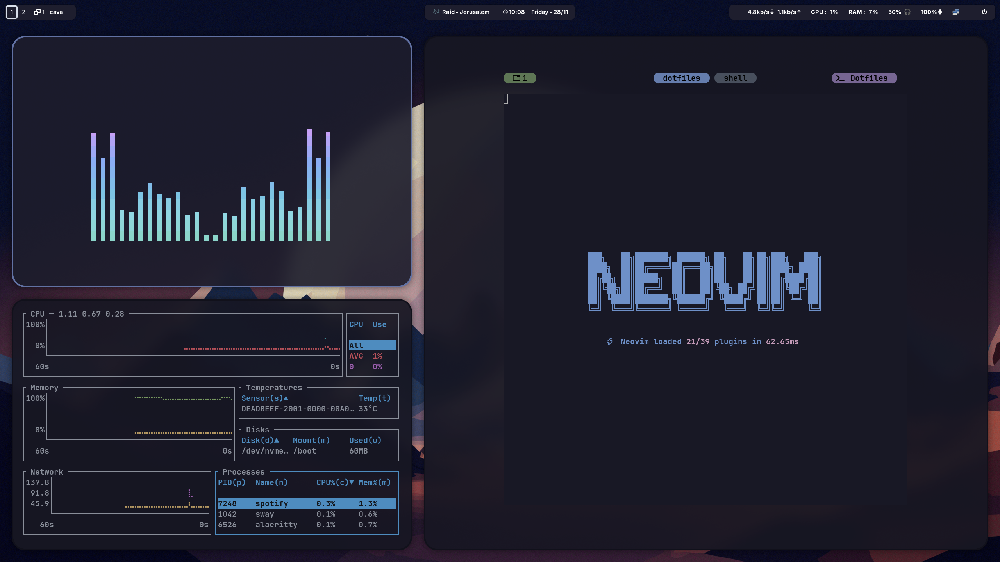
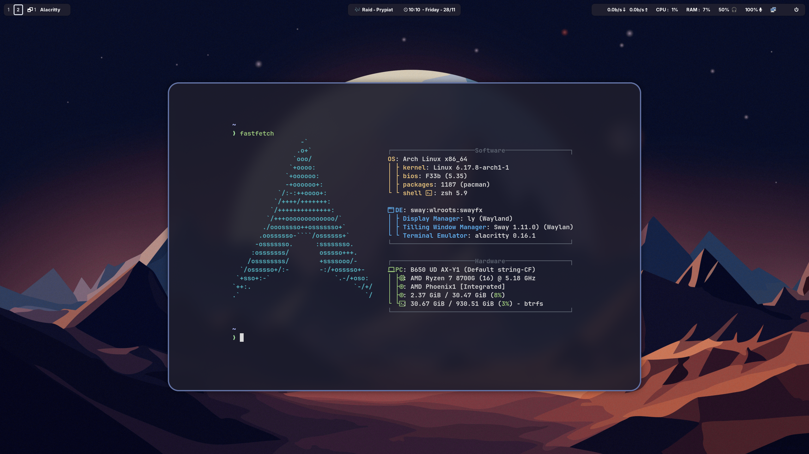
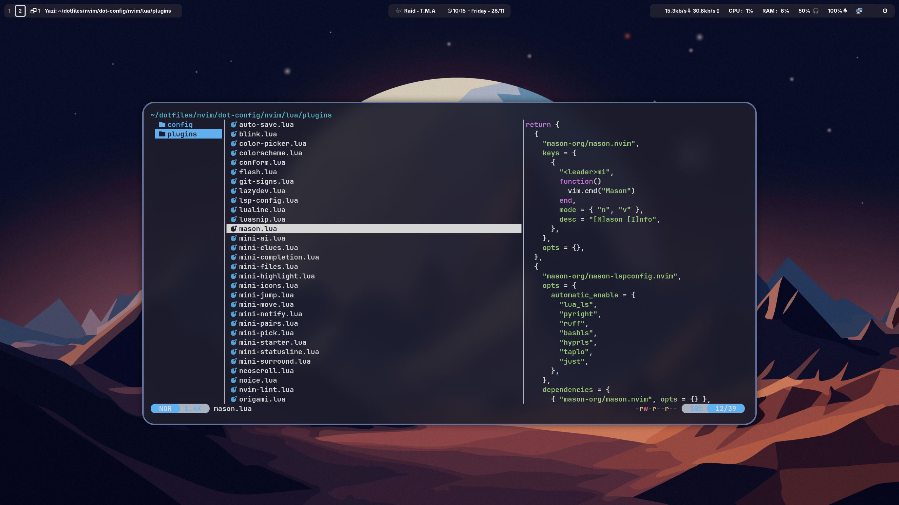
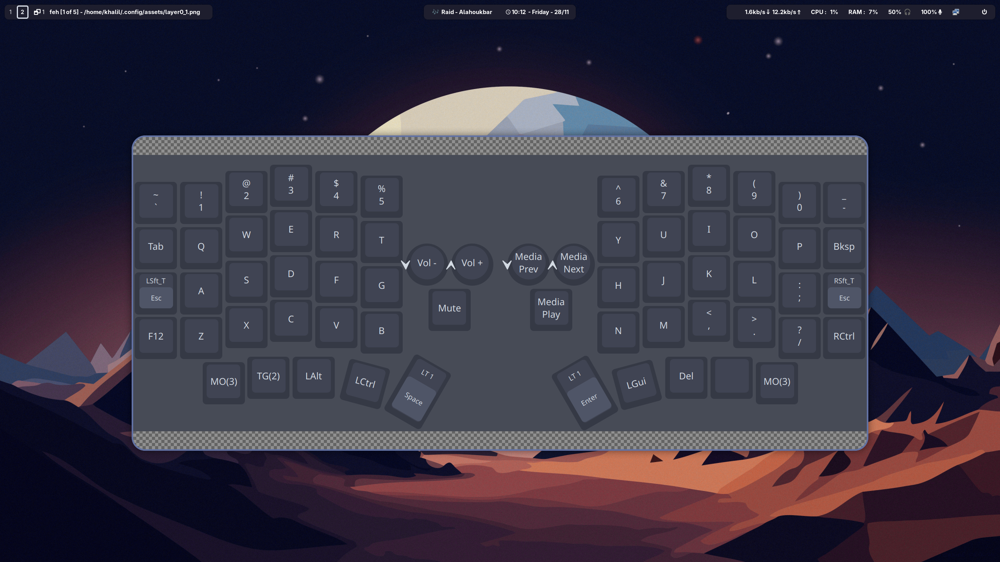
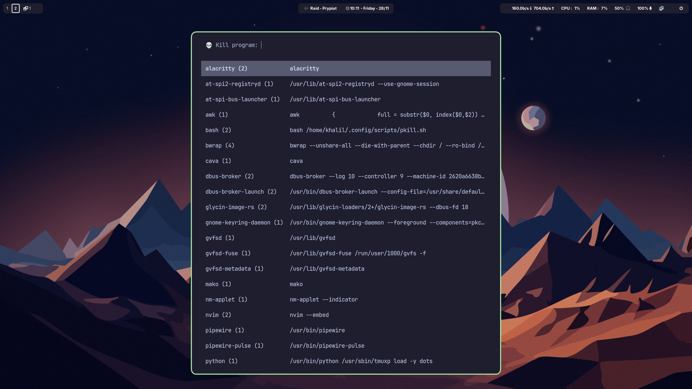
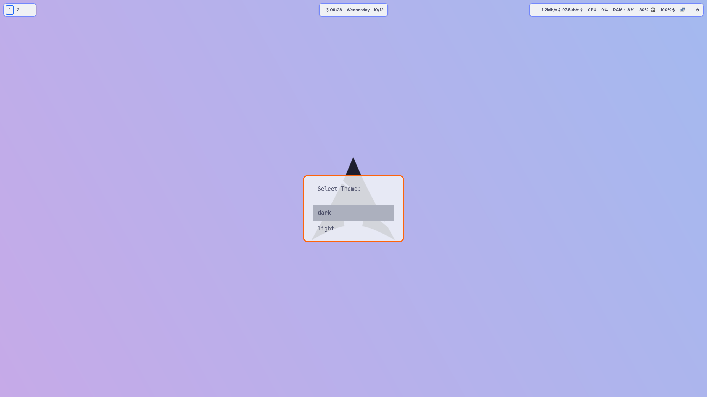
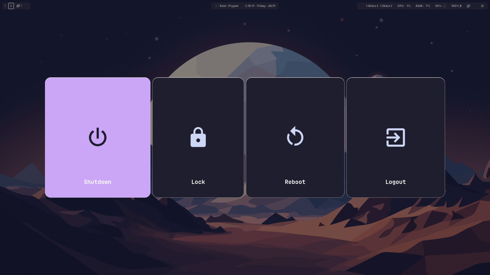
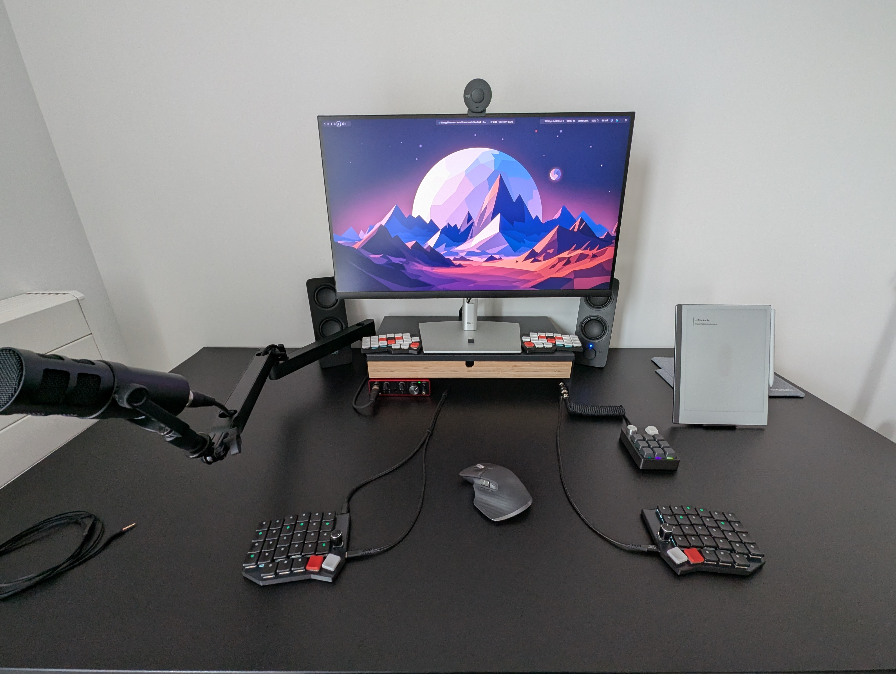
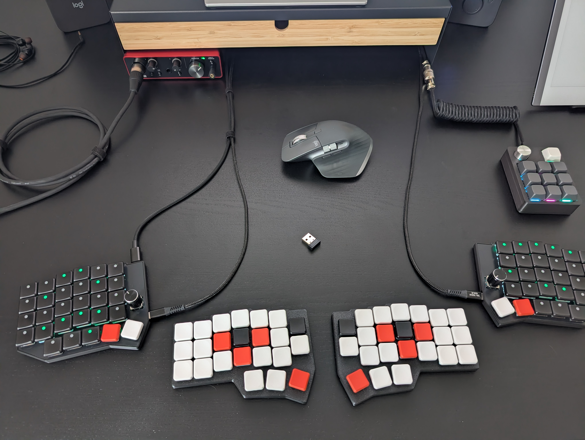

# Dotfiles

Since i really care about (my) development experience, this is my second iteration of the [CYBORG PROJECT](https://github.com/H-ADJI/cyborg).
Feel free to copy or look around for inspiration.

## Setup

A single command to setup my machine automagically :D.
I hope i didn't leak any unencrypted secrets or ssh keys.

```bash
curl -fsSL h-adji.github.io/doftiles/init.sh | bash
```

## Content

- Dotfiles for my **PDE** (Personalized Development Environment) :
  - Sway (swayfx) minimalistic rice for maximum productivity
  - Homemade Neovim config
  - Alacritty simple yet effective
  - Tmux for terminal multitasking and wizardry
  - ZSH, no idea why i choose it
  - Starship for a pretty shell prompt
  - plus a lot of other tools...
- justfile to automate testing of installation process.

## Roadmap

- add mybattlestation link
- themes / wallpapers picker
- based screen recording
- connect tmux / nvim over ssh
- arch packages info , search , installed , installer picker

## Nerd snipes

### App launcher


### Audio input picker


### Audio output picker


### Text editor



### Tiling windows



### Fastfetch



### File explorer



### Keyboard layout/layers viewer



### Pkill menu



### Live themes switcher




### Power menu



### Battlestation



