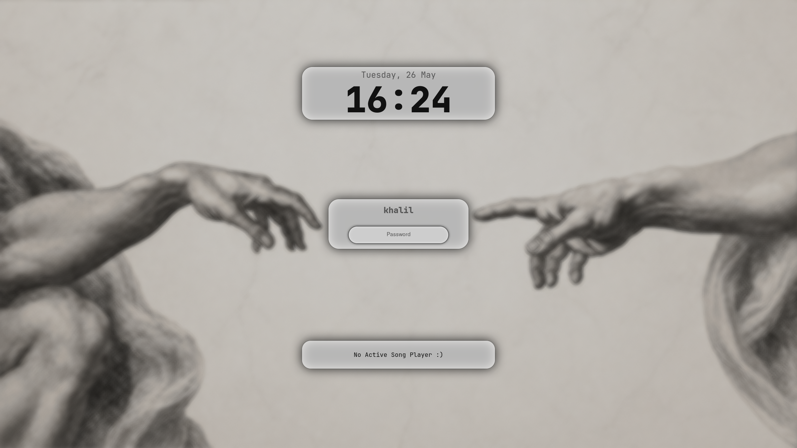
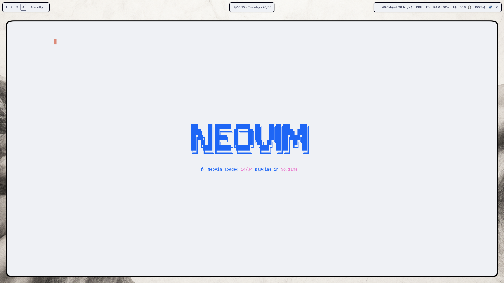
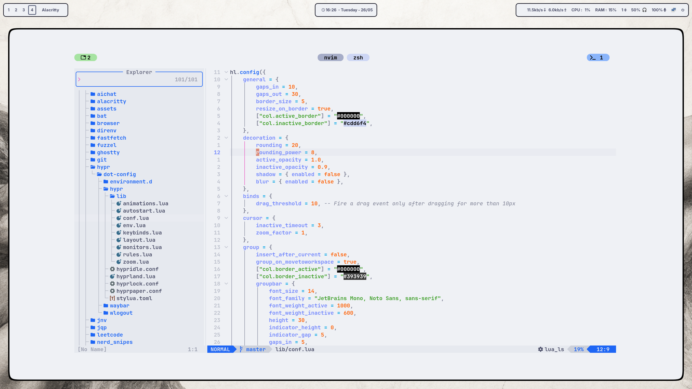
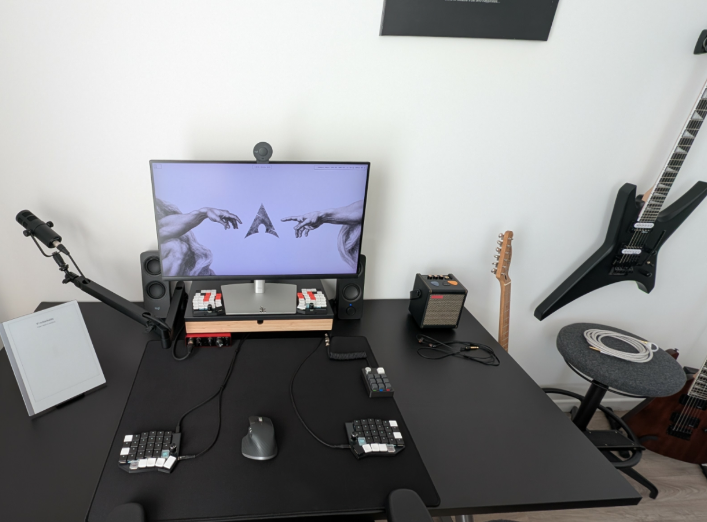

# Dotfiles

Since I really care about (my) development experience, this is my second iteration of the [CYBORG PROJECT](https://github.com/H-ADJI/cyborg).
Feel free to copy or look around for inspiration.

## Setup

A single command to setup my machine automagically :D.
I hope I didn't leak any unencrypted secrets or ssh keys.

**Arch Install Configuration**

```bash
archinstall --config-url https://conf.hadji.org/workstation.json
```

or

```bash
archinstall --config-url https://raw.githubusercontent.com/H-ADJI/homelab/master/caddy/static/archinstall/workstation.json
```

**Desktop Environment**

```bash
curl -fsSL conf.hadji.org/setup | bash
```

or

```bash
curl -fsSL h-adji.github.io/dotfiles/init.sh | bash
```

## Content

- Dotfiles for my **PDE** (Personalized Development Environment) :
  - **[v2.0]** Hyprland
  - **[v1.2]** Sway (swayfx) minimalistic rice for maximum productivity
  - Homemade Neovim config
  - Alacritty simple yet effective
  - Tmux for terminal multitasking and wizardry
  - ZSH, no idea why i choose it
  - Starship for a pretty shell prompt
  - plus a lot of other tools...
- justfile to automate testing of installation process.

## Nerd snipes

### Desktop


### Lock Screen



### Neovim




### Battlestation


